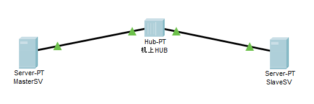

# サーバー構築実習（CentOS7）

## DNSサーバ構築（応用）

## DNSスレーブサーバ構築

### スレーブサーバとは

ゾーン転送を使用して、ゾーンデータを得るネームサーバ（権威DNSサーバ）のこと。ゾーン転送は、ゾーンファいるに記載されたレコード等の情報を別のサーバに送ること。ネームサーバは、多重化することで負荷分散や冗長化を図ることができます。多重化する際には、扱うゾーンデータのマスターを管理するネームサーバを用意し、そのゾーンデータをコピーして別のネームサーバーを動かします。この時、コピー元のネームサーバーが「プライマリサーバ（マスターサーバ）」で、コピー先のネームサーバが「セカンダリサーバ（スレーブサーバ）」となる。

## ネームサーバサーバの構築


### 構築するネームサーバの設定

| 名前 | ホスト名 | IPアドレス |
| ---- | ---- | ---- |
| ネームサーバ(マスタサーバ) | ns1.itxx.sangi.com | 10.45.46.xx |
| ネームサーバ(スレーブサーバ) | ns2.itxx.sangi.com | 10.45.46.xx+1 |

### マスターサーバ構築

### DNSサーバ（BIND）のインストール

- BINDのインストール
- bind-chrootのインストール

```shell
[root@localhost ~]# yum -y install bind bind-chroot
```

### namde.confの設定

以下のコマンドにて、named.confを開きます。

```shell
[root@localhost ~]# vim /etc/named.conf
```

以下の設定箇所を追加及び変更する。

- acl localnet {
    127.0.0.1;
    10.45.46.0/24;
};
- listen-on port 53 { localnet; };
- //listen-on-v6 port 53 { ::1; };  //IPv6は使用しないのでコメントアウト
- allow-query { localnet; }; //問合わせを許可する範囲
- allow-transfer { localnet; }; //ゾーン転送を許可する範囲
- 正引きゾーンと逆引きゾーンの追加

| ゾーン種類 | タイプ | ゾーン名 | ファイル名 |
| --- | --- | --- | --- |
| 正引き | master |itxx.sangi.com | itxx.sangi.com.zone |
| 逆引き | master | 46.45.10.in-addr.arpa | 46.45.10.in-addr.arpa.rzone |

```shell
/
// named.conf
//
// Provided by Red Hat bind package to configure the ISC BIND named(8) DNS
// server as a caching only nameserver (as a localhost DNS resolver only).
//
// See /usr/share/doc/bind*/sample/ for example named configuration files.
//
// See the BIND Administrator's Reference Manual (ARM) for details about the
// configuration located in /usr/share/doc/bind-{version}/Bv9ARM.html
acl localnet {
    127.0.0.1;
    10.45.46.0/24;
};
options {
    listen-on port 53 { localnet; };
    //listen-on-v6 port 53 { ::1; };
    directory       "/var/named";
    dump-file       "/var/named/data/cache_dump.db";
    statistics-file "/var/named/data/named_stats.txt";
    memstatistics-file "/var/named/data/named_mem_stats.txt";
    recursing-file  "/var/named/data/named.recursing";
    secroots-file   "/var/named/data/named.secroots";
    allow-query { localnet; };
    allow-transfer { localnet; };

    /* 省略 */
    
    recursion yes;

    dnssec-enable yes;
    dnssec-validation yes;

    /* Path to ISC DLV key */
    bindkeys-file "/etc/named.root.key";

    managed-keys-directory "/var/named/dynamic";

    pid-file "/run/named/named.pid";
    session-keyfile "/run/named/session.key";
};

logging {
    channel default_debug {
            file "data/named.run";
            severity dynamic;
    };
};

zone "." IN {
    type hint;
    file "named.ca";
};

zone "it00.sangi.com" IN {
    type master;
    file "it00.sangi.com.zone";
};

zone "46.45.10.in-addr.arpa.rzone" IN {
    type master;
    file "46.45.10.in-addr.arpa.rzone";
};

include "/etc/named.rfc1912.zones";
include "/etc/named.root.key";
```

### named.confのチェック

```shell
[root@localhost ~]# named-checkconf
```

### ゾーンファイルの作成

- 作成するゾーン

    - 正引きドメイン「itxx.sangi.com」
    - 逆引きドメイン「46.45.10.in-addr.arpa」

- SOAレコードの定義

| 書式 | 内容 |
| --- | --- |
| it.sangi.com.(または@) | このゾーンの名前 |
| IN | Internetクラス |
| SOA | Start Of Authority |
| ns1.it00.sangi.com. | このゾーンのマスターネームサーバ |
| postmaster.it00.sangi.com. | 管理者のメールアドレス(postmaster@it00.sangi.com.だが、@マークはドメインの省略になるので、.ピリオド) |
| 2023033001 | シリアル番号(YYYYMMDDnn) |
| 3h | スレーブサーバがマスターサーバの更新を確認する間隔 |
| 1h | スレーブサーバがゾーン転送失敗時の再試行間隔 |
| 1w | スレーブサーバがゾーン転送失敗時におけるゾーン情報の有効期間 |
| 1h | リゾルバが問い合わせに失敗したとき、キャッシュする間隔 |

- itxx.sangidai.com.zoneを作成

```shell
[root@localhost ~]# vim /var/named/it00.sangi.com.zone
```

以下のように記述する。

```shell
$TTL    86400
@       IN      SOA     ns1.it00sangi.com. postmaster.j00.sangi.com. (
                2023033001      ;serial
                3h              ;refresh
                1h              ;retry
                1w              ;expire
                1h )            ;minimum


        IN      NS      ns1.it00.sangi.com.
        IN      NS      ns2.it00.sangi.com.

ns1     IN      A       10.45.46.xx
ns2     IN      A       10.45.46.xx+1
```

- 46.45.10.in-addr.arpa.rzoneを作成

```shell
[root@localhost ~]# vim /var/named/46.45.10.in-addr.arpa.rzone
```

以下のように記述する。

```shell
$TTL    86400
@       IN      SOA     ns1.j00.sangidai.com. postmaster.j00.sangidai.com. (
                2022111701      ;serial
                3h              ;refresh
                1h              ;retry
                1w              ;expire
                1h )            ;minimum

        IN      NS      ns1.it00.sangi.com.
        IN      NS      ns2.it00.sangi.com.

xx      IN      PTR     ns1.it00.sangi.com.
xx+1    IN      PTR     ns2.it00.sangi.com. 
```

### ゾーンファイルの確認

```shell
[root@localhost ~]# named-checkzone itxx.sangi.com /var/named/itxx.sangi.com.zone
```

以下のように表示されれば成功

```shell
zone j00.sangidai.com/IN: loaded serial 2022111702
OK
```

```shell
[root@localhost ~]# named-checkzone 46.45.10.in-addr.arpa /var/named/46.45.10.in-addr.arpa.rzone
```

以下のように表示されれば成功

```shell
zone 46.45.10.in-addr.arpa/IN: loaded serial 2022111701
OK
```

### BINDの操作

- BINDの起動

```shell
[root@localhost ~]# systmel start named-chroot.service
```

- OS起動時にBINDの自動起動を有効化

```shell
[root@localhost ~]# systemctl enable named-chroot.service
```

### ファイアウォールの操作

- FirewallにDNSサービス用の接続を許可
- 恒久的に適用

```shell
[root@localhost ~]# firewall-cmd --add-service=dns --zone=public --permanent
```

successと表示されれば成功

- Firewallを再起動

```shell
[root@localhost ~]# firewall-cmd --reload
success
```

- FirewallにDNSが許可されているかを確認

```shell
[root@localhost ~]# firewall-cmd --list-service
```

### スレーブサーバ構築

### DNSサーバ（BIND）のインストール

- BINDのインストール
- bind-chrootのインストール

```shell
[root@localhost ~]# yum -y install bind bind-chroot
```

### namde.confの設定

以下のコマンドにて、named.confを開きます。

```shell
[root@localhost ~]# vim /etc/named.conf
```

以下の設定箇所を追加及び変更する。

- acl localnet {
    127.0.0.1;
    10.45.46.0/24;
};
- listen-on port 53 { localnet; };
- //listen-on-v6 port 53 { ::1; };  //IPv6は使用しないのでコメントアウト
- allow-query { localnet; }; //問合わせを許可する範囲
- allow-transfer { localnet; }; //ゾーン転送を許可する範囲
- 正引きゾーンと逆引きゾーンの追加

| ゾーン種類 | タイプ | ゾーン名 | ファイル名 |
| --- | --- | --- | --- |
| 正引き | slave |itxx.sangi.com | itxx.sangi.com.zone.bak |
| 逆引き | slave | 46.45.10.in-addr.arpa | 46.45.10.in-addr.arpa.rzone.bak |

```shell
/
// named.conf
//
// Provided by Red Hat bind package to configure the ISC BIND named(8) DNS
// server as a caching only nameserver (as a localhost DNS resolver only).
//
// See /usr/share/doc/bind*/sample/ for example named configuration files.
//
// See the BIND Administrator's Reference Manual (ARM) for details about the
// configuration located in /usr/share/doc/bind-{version}/Bv9ARM.html
acl localnet {
    127.0.0.1;
    10.45.46.0/24;
};
options {
    listen-on port 53 { localnet; };
    //listen-on-v6 port 53 { ::1; };
    directory       "/var/named";
    dump-file       "/var/named/data/cache_dump.db";
    statistics-file "/var/named/data/named_stats.txt";
    memstatistics-file "/var/named/data/named_mem_stats.txt";
    recursing-file  "/var/named/data/named.recursing";
    secroots-file   "/var/named/data/named.secroots";
    allow-query { localnet; };
    allow-transfer { localnet; };

    /* 省略 */
    
    recursion yes;

    dnssec-enable yes;
    dnssec-validation yes;

    /* Path to ISC DLV key */
    bindkeys-file "/etc/named.root.key";

    managed-keys-directory "/var/named/dynamic";

    pid-file "/run/named/named.pid";
    session-keyfile "/run/named/session.key";
};

logging {
    channel default_debug {
            file "data/named.run";
            severity dynamic;
    };
};

zone "." IN {
    type hint;
    file "named.ca";
};

zone "it00.sangi.com" IN {
    type slave;
    file "slaves/it00.sangi.com.zone.bak";
    masters { 10.45.46.xx; }; //マスターサーバのIP
};

zone "46.45.10.in-addr.arpa.rzone" IN {
    type slave;
    file "slaves/46.45.10.in-addr.arpa.rzone.bak";
    masters { 10.45.46.xx; };　//マスターサーバのIP
};

include "/etc/named.rfc1912.zones";
include "/etc/named.root.key";
```

### named.confのチェック

```shell
[root@localhost ~]# named-checkconf
```

### ゾーンファイルの作成

スレーブサーバは、マスターからの転送を受けて自動的に生成されるため、作成が不要である。

### ファイアウォールの操作

- FirewallにDNSサービス用の接続を許可
- 恒久的に適用

```shell
[root@localhost ~]# firewall-cmd --add-service=dns --zone=public --permanent
```

successと表示されれば成功

- Firewallを再起動

```shell
[root@localhost ~]# firewall-cmd --reload
success
```

- FirewallにDNSが許可されているかを確認

```shell
[root@localhost ~]# firewall-cmd --list-service
```

### ポイント

ゾーン情報の更新(ゾーン転送のタイミング)は、マスターサーバが以下の条件において、スレーブサーバへゾーンデータの更新(notify)を行う

- マスターサーバが起動(再起動)したとき
- マスターサーバのゾーンファイルにおいて、SOAレコードのシリアル値が増加したとき

スレーブサーバはマスターサーバより上記を通知を受信したら、自身が保持しているゾーンデータより新しければ(SOAのserialが増加している)、マスターサーバへゾーン転送を要求する。つまり、マスターサーバでゾーンファイルの変更や追加などの更新をした際、シリアルをインクリメントすることが重要である。


### 動作確認

- スレーブサーバのDNSサーバをマスターサーバのIPに設定
- スレーブサーバで使用しているWindowsPCのDNSをスレーブサーバのIPに設定
- マスターサーバのbindを再起動
- スレーブサーバのbindを再起動
- WindowsPCのコマンドプロンプトからnslookupで名前解決をする

※ うまく動作しなかったとき、スレーブサーバのターミナル上で以下のコマンドを打つ。

```shell
[root@localhost ~]# tail -f /var/named/data/named.run
```

ログメッセージ内に、`notify`をいうメッセージがあれば受信したことが確認できる。もし、確認できない場合、正引きと逆引きゾーンファイルのシリアルをインクリメントする。
